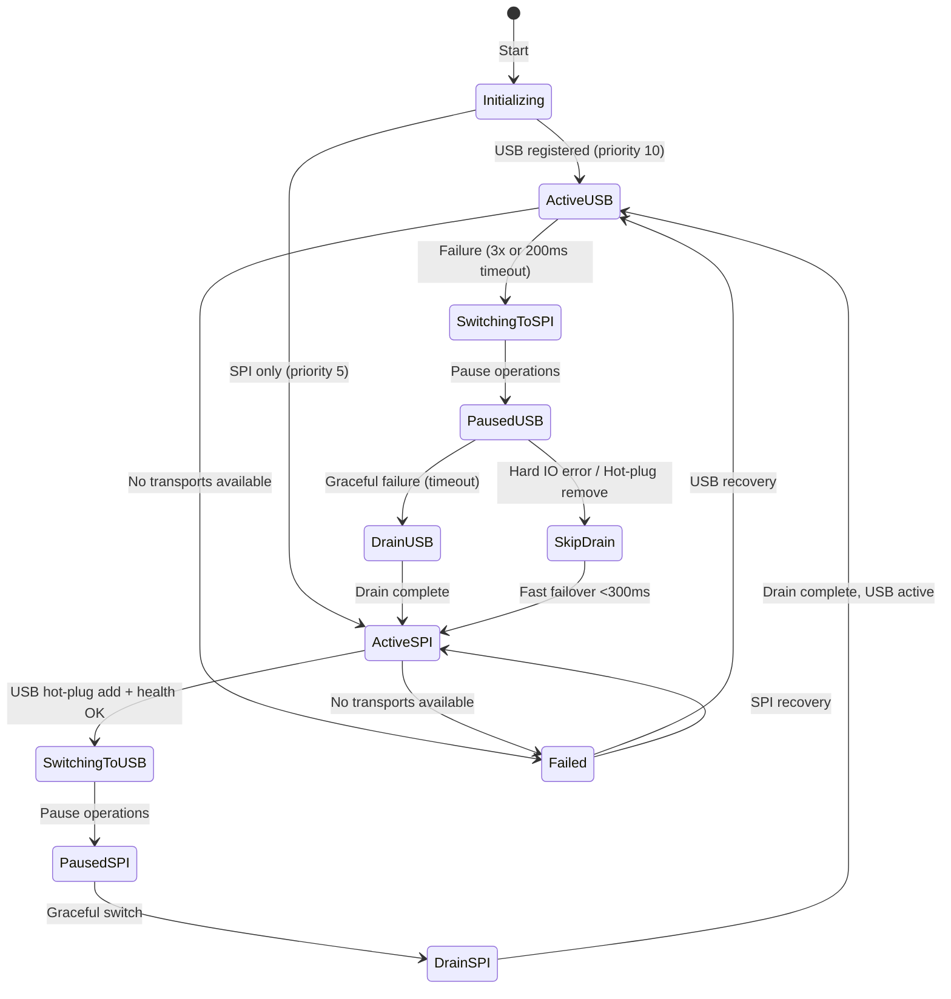

# STAR Gateway Transport Architecture

## Overview

The STAR Gateway implements intelligent transport switching between USB CDC (primary) and SPI (backup) for communication with the RX72N motor controller. The system automatically prefers USB for its simplicity but seamlessly fails over to SPI if USB becomes unavailable, with automatic recovery when USB returns.

**Design Philosophy:**
- **Lightweight CDC Protocol**: No application-level HARQ (USB hardware provides reliability)
- **Hybrid Heartbeat**: Implicit detection via telemetry + explicit PING/PONG when idle
- **Circuit Breaker Pattern**: Fast failure detection (~200ms) with automatic failover
- **Smart Switching**: Skip drain on hard failures, shared sequence state across transports
- **Zero Data Loss**: Sequence continuity maintained during transport switches

## Architecture Diagram

```
┌─────────────────────────────────────────────────────────────────┐
│                        gRPC Clients (UI)                        │
└────────────────────────────┬────────────────────────────────────┘
                             │ Protobuf/gRPC
┌────────────────────────────▼────────────────────────────────────┐
│              Layer 5: gRPC Services                             │
│  MotorControl │ Telemetry │ Battery │ Config │ Firmware        │
└────────────────────────────┬────────────────────────────────────┘
                             │
┌────────────────────────────▼────────────────────────────────────┐
│         Layer 4.5: Dispatcher (Message Router)                  │
│  - Demultiplexes by message type                                │
│  - Pub/sub to services                                          │
└────────────────────────────┬────────────────────────────────────┘
                             │
┌────────────────────────────▼────────────────────────────────────┐
│         Layer 4: Transport Manager (Smart Switching)            │
│  ┌──────────────────────────────────────────────────────────┐  │
│  │ State: Active USB │ Active SPI │ Switching │ Degraded    │  │
│  ├──────────────────────────────────────────────────────────┤  │
│  │ Health Monitor: Tracks consecutive failures, latency     │  │
│  │ Hot-Plug Detector: USB add/remove events (inotify)       │  │
│  │ Heartbeat Manager: Implicit + Explicit (PING/PONG)       │  │
│  │ Session State: Shared sequence counters (TX/RX)          │  │
│  └──────────────────────────────────────────────────────────┘  │
│                             │                                   │
│              ┌──────────────┴──────────────┐                    │
│              │                             │                    │
│    ┌─────────▼─────────┐        ┌─────────▼─────────┐          │
│    │   USB CDC Link    │        │    SPI Link       │          │
│    │ (Lightweight)     │        │  (Full HARQ)      │          │
│    │ - Framing only    │        │  - Retransmit     │          │
│    │ - Sequence track  │        │  - FEC (Viterbi)  │          │
│    │ - CRC32 validate  │        │  - Soft combining │          │
│    │ - NO retries      │        │  - ACK/NACK       │          │
│    └─────────┬─────────┘        └─────────┬─────────┘          │
└──────────────┼──────────────────────────────┼──────────────────┘
               │                              │
     ┌─────────▼─────────┐          ┌────────▼────────┐
     │  CDCTransport     │          │  SPITransport   │
     │  (USB CDC)        │          │  (10MHz SPI)    │
     │  /dev/ttyACM0     │          │  /dev/spidev0.0 │
     └─────────┬─────────┘          └────────┬────────┘
               │                              │
          ┌────▼──────────────────────────────▼────┐
          │           Raspberry Pi 5                │
          └────────────────┬────────────────────────┘
                           │ USB / SPI
          ┌────────────────▼────────────────────────┐
          │   RX72N Motor Controller (ThreadX)      │
          │   - Motor control (100Hz)                │
          │   - Encoder feedback                     │
          │   - Telemetry generation                 │
          └──────────────────────────────────────────┘
```

## Transport Comparison

| Feature | SPI Path | USB CDC Path | Rationale |
|---------|----------|--------------|-----------|
| **Physical Layer** | Full-duplex, synchronous | Half-duplex, asynchronous | Hardware characteristic |
| **Frame Format** | `[SYNC][SEQ][LEN][TYPE][FLAGS][PAYLOAD][CRC32]` | Same format | Unified for easy switching |
| **Error Detection** | CRC32 + FEC | CRC32 only | USB hardware has built-in CRC |
| **Retransmission** | Application-level (HARQ) | Hardware-level only | USB bulk transfer handles retries |
| **FEC** | Viterbi + Chase Combining | Disabled | Redundant with USB reliability |
| **ACK/NACK** | Required | Not sent | USB provides implicit ACK |
| **Sequence Tracking** | 16-bit counter (shared SessionState) | 16-bit counter (shared SessionState) | Both transports share SessionState for sequence continuity during failover |
| **Priority** | Priority 5 | Priority 10 | Prefer simpler USB |
| **Typical Latency** | 1-2ms | <1ms | USB has lower overhead |
| **Reliability** | 99.99% (with retries) | 99.999% (hardware CRC) | USB more reliable |

## Decision Record

| Decision | Choice | Rationale |
|----------|--------|-----------|
| SYNC word | `0x55AA` | Both sides agree; standard framing marker |
| Header byte order | Little-endian | Consistent with CRC-32; both sides agree |
| CRC-32 byte order | **Little-endian** (IEEE 802.3 LSB-first) | Industry standard; firmware was correct, Go fixed in Phase 1 |
| Canonical TYPE values | `0x00/0x01/0x10-0x13/0xFE/0xFF` | Designed for full protocol; firmware aligned in Phase 2 |
| HARQ type | Chase Combining (Type I) | Implemented end-to-end; Type II is aspirational |
| DTC/DMA for SPI | Deferred | Polling works at 10MHz/1024B; needs real hardware to test |
| PING interval | 1s (was 50ms) | Dual-detection model: implicit timeout is primary; PING is idle probe |

## Protocol Specification

### Frame Format

All frames use the same wire format regardless of transport:

```text
┌──────┬──────┬──────┬──────┬───────┬─────────┬─────────┐
│ SYNC │ SEQ  │ LEN  │ TYPE │ FLAGS │ PAYLOAD │ CRC-32  │
│ (LE) │ (LE) │ (LE) │      │       │         │  (LE)   │
├──────┼──────┼──────┼──────┼───────┼─────────┼─────────┤
│ 2B   │ 2B   │ 2B   │ 1B   │ 1B    │ 0-1024B │ 4B      │
└──────┴──────┴──────┴──────┴───────┴─────────┴─────────┘
```

**Header Fields (little-endian):**
- **SYNC**: Magic number `0x55AA` for frame synchronization
- **SEQ**: Sequence number (0-65535, wraps around)
- **LEN**: Payload length in bytes
- **TYPE**: Frame type (see below)
- **FLAGS**: Control flags (RequiresAck, HasFEC, etc.)
- **PAYLOAD**: Variable-length data (Protocol Buffer message)

**Checksum (little-endian, IEEE 802.3 LSB-first):**
- **CRC-32**: Computed over SYNC + header + payload, stored in little-endian byte order

### Frame Types

The protocol defines the following frame types:

- **0x00 (PING)**: Heartbeat request - sent when link is idle for >1s
- **0x01 (PONG)**: Heartbeat response - echoes PING counter
- **0x10 (COMMAND)**: Command frame carrying protobuf messages
- **0x11 (RESPONSE)**: Response frame carrying protobuf messages
- **0x12 (ACK)**: Acknowledgment (SPI only, HARQ protocol)
- **0x13 (NACK)**: Negative acknowledgment (SPI only, HARQ protocol)
- **0xFE (RESET_ACK)**: Acknowledgment of session reset
- **0xFF (RESET)**: Request to reset session (synchronize sequences)

**PING Frame:**
- **TYPE**: `0x00`
- **PAYLOAD**: 4-byte counter (little-endian uint32)
- **Purpose**: Explicit idle-link probe when no frames for >1s

**PONG Frame:**
- **TYPE**: `0x01`
- **PAYLOAD**: Echo of PING counter
- **Purpose**: Confirm link health, validate round-trip
- **Auto-response**: Both firmware and gateway auto-send PONG on PING receipt

**RESET Frame:**
- **TYPE**: `0xFF`
- **PAYLOAD**: None
- **Purpose**: Request session reset (synchronize sequences)

**RESET_ACK Frame:**
- **TYPE**: `0xFE`
- **PAYLOAD**: None
- **Purpose**: Acknowledge session reset, confirm synchronization

### USB CDC Protocol (Lightweight)

The CDC protocol is designed for minimal overhead, relying on USB hardware for reliability:

**Send Path:**
1. Acquire `sendMutex` (serialize concurrent sends)
2. Get next TX sequence from shared `SessionState`
3. Create frame with sequence, CRC32
4. Encode to wire format
5. Write to `/dev/ttyACM0` with 50ms deadline
6. Release mutex (no wait for ACK)

**Receive Path:**
1. Read from `/dev/ttyACM0`
2. Decode frame, validate CRC32
3. Check sequence via `SessionState.ValidateRxSequence()`
   - Accept exact match (expected sequence)
   - Accept small gaps (<10 frames, log warning)
   - Reject duplicates or large gaps
4. Return payload to caller

**Key Features:**
- ✅ Sequence tracking via shared SessionState
- ✅ CRC32 validation
- ❌ No application-level retries
- ❌ No FEC encoding
- ❌ No ACK/NACK frames

### SPI Protocol (Full HARQ)

The SPI protocol uses Chase Combining (Type I HARQ) for robustness:

**Send Path:**
1. Create frame with sequence, RequiresAck flag
2. Encode with Viterbi FEC (rate 1/2, K=7)
3. Calculate CRC32
4. Transfer via full-duplex SPI (10MHz)
5. Wait for ACK/NACK (timeout: 10ms)
6. On NACK: retransmit (up to 3 attempts)

**Receive Path:**
1. Full-duplex SPI transfer
2. Viterbi decode with soft-bit combining
3. Validate CRC32
4. Check sequence (strict validation)
5. Send ACK or NACK based on CRC result
6. Chase combine on retransmissions

**Key Features:**
- ✅ Application-level retries (up to 3x)
- ✅ Viterbi FEC with soft combining
- ✅ ACK/NACK handshake
- ✅ Sequence tracking (shared SessionState with USB for failover continuity)

## Heartbeat Mechanism

### Dual-Detection Model

The heartbeat system uses two complementary detection mechanisms:

**1. Implicit Timeout (Primary) — 200ms**
- Update `LastSeen` timestamp when ANY valid frame arrives (COMMAND, RESPONSE, PING, etc.)
- If no frames for 200ms → declare link dead, trigger failover
- Zero overhead when link is active — data frames implicitly serve as heartbeats

**2. Explicit PING (Secondary) — 1s idle-link probe**
- Send PING with 4-byte counter if link idle for >1s
- Wait for PONG echo; validate counter matches
- 1 consecutive miss → trigger failover
- Rarely fires under normal traffic; only needed when link is genuinely idle

**Timing Budget:**

```text
Implicit timeout:    200ms  (primary detection, any frame resets)
Check interval:       50ms  (failureTimeout / 4, worst-case detection ~250ms)
PING interval:      1000ms  (secondary, idle-link probe)
WDT timeout:        1000ms  (RX72N hardware watchdog)
Safety margin:         4x   (250ms worst-case << 1000ms WDT)
```

**Control Frame Dispatching:**
- Both firmware (C) and gateway (Go) auto-respond PONG to PING
- Both auto-respond RESET_ACK to RESET
- Control frames (PING, PONG, ACK, NACK, RESET_ACK) are consumed internally
- Only data frames (COMMAND, RESPONSE) are returned to callers

### Heartbeat Manager

The Heartbeat Manager tracks link health using the following state:

- **lastSeen**: Timestamp of last valid frame received (any type)
- **lastValidPong**: Timestamp of last valid PONG response
- **pingCounter**: Counter incremented with each PING sent
- **lastPingSent**: Counter value of most recent PING
- **pendingPing**: Flag indicating PING awaiting PONG response
- **consecutiveMisses**: Count of consecutive missed heartbeats
- **pingInterval**: Interval for explicit PING probes (1 second)
- **failureTimeout**: Timeout for implicit detection (200ms)
- **onLinkFailed**: Callback to TransportManager on link failure

**Benefits:**
- Minimal bandwidth overhead (PING only when idle)
- Fast failure detection (~250ms worst-case with 50ms check interval)
- 4x safety margin below WDT timeout
- PONG validation prevents stale/replayed responses
- PONG auto-reply bypasses operations gate (no deadlock during transport switch)

## State Machine



**State Descriptions:**

| State | Description | Actions |
|-------|-------------|---------|
| **Initializing** | Manager starting, detecting transports | Register transports, select best |
| **ActiveUSB** | USB CDC active, heartbeat monitoring | Send/Receive via USB, monitor health |
| **ActiveSPI** | SPI active, heartbeat monitoring | Send/Receive via SPI, monitor health |
| **SwitchingToSPI** | Transitioning USB → SPI | Pause operations, smart drain (conditional) |
| **SwitchingToUSB** | Transitioning SPI → USB | Pause operations, smart drain (conditional) |
| **Degraded** | Active transport unhealthy, no alternatives | Continue with degraded transport, log warnings |
| **Failed** | No healthy transports available | Log error, retry probing |

**Note:** Operations are paused during switching states, and smart drain logic conditionally drains in-flight operations based on failure type (graceful/timeout drain, hard failures skip).

## Failover Logic

### Trigger Conditions

| Trigger | Failure Type | Drain? | Failover Time |
|---------|--------------|--------|---------------|
| 3 consecutive Send/Receive failures | `FailureTypeIOError` | Skip | <300ms |
| 200ms heartbeat timeout | `FailureTypeTimeout` | Execute | <700ms |
| USB hot-plug remove event | `FailureTypeHotPlugRemove` | Skip | <300ms |
| Health check failed (probe) | `FailureTypeHealthCheck` | Skip | <300ms |
| Manual switch (config change) | `FailureTypeGraceful` | Execute | <1s |

### Smart Drain Logic

The transport manager uses **smart drain logic** to minimize failover time by conditionally draining based on failure type:

**Failure Types:**
- **Graceful**: Config change, priority upgrade - drain is safe
- **Timeout**: Heartbeat timeout - drain is safe
- **IOError**: Hard IO error - skip drain for fast failover
- **HealthCheck**: Failed health check - skip drain
- **HotPlugRemove**: USB unplugged - skip drain

**Switch Execution Steps:**
1. Pause operations (block new Send/Receive calls)
2. Smart drain decision:
   - Graceful/Timeout failures: Wait up to 500ms for in-flight operations to complete
   - Hard failures (IOError, HotPlugRemove, HealthCheck): Skip drain, failover immediately
3. Reset old transport (if accessible)
4. Activate new transport
5. Resume operations (unblock Send/Receive)

**Rationale:**
- **Graceful switches** (timeout, config change): Safe to wait 500ms for drain
- **Hard failures** (USB disconnect, IO error): Device non-responsive, skip drain for fast failover

### Sequence Continuity

**Critical Design Decision**: Sequence numbers are **shared across all transports** via SessionState.

**SessionState Fields:**
- **txSequence**: 16-bit transmit sequence counter (incremented on every Send)
- **rxSequence**: 16-bit receive sequence counter (validated on every Receive)
- **Mutex**: Protects concurrent access to sequence counters

**Why This Matters:**
- If USB fails at TX Sequence 105 and switches to SPI, SPI must start at 106
- If SPI reset to 0, RX72N would reject packets as duplicates
- Shared state ensures **zero duplicate execution** during transport switches

**Sequence Validation Logic:**

The receive sequence validation accepts frames in three cases:

1. **Exact match**: Received sequence equals expected sequence (most common case)
   - Increment expected sequence and accept

2. **Small gap**: Received sequence is ahead by 1-10 frames
   - Log warning about potential packet loss
   - Update expected sequence to received + 1
   - Accept frame (allows recovery from minor packet loss)

3. **Large gap or duplicate**: Difference > 10 or sequence behind expected
   - Log error with sequence mismatch details
   - Reject frame

**Implementation References (source of truth):**
- Gap threshold constant: `MaxGapTolerance` in [`internal/manager/session.go`](internal/manager/session.go)
- Validation function: `(*SessionState).ValidateRxSequence` in [`internal/manager/session.go`](internal/manager/session.go)
- TX sequence increment under mutex: `(*SessionState).NextTxSequence` in [`internal/manager/session.go`](internal/manager/session.go)
- RX/TX sequence continuity call sites:
   - `(*CDCLink).Send` and `(*CDCLink).Receive` in [`internal/link/cdc.go`](internal/link/cdc.go)
   - `(*SPILink).Send` and `(*SPILink).Receive` in [`internal/link/spi.go`](internal/link/spi.go)

`txSequence`/`rxSequence` comparisons and updates happen under `SessionState.mu` inside
`NextTxSequence` and `ValidateRxSequence`, so the documented 10-frame behavior is enforced by code,
not by documentation text.

## Health Monitoring

### Health Metrics

Each transport tracks the following metrics:

- **ConsecutiveFailures**: Count of consecutive errors (reset on success)
- **TotalSent**: Total frames sent since start
- **TotalReceived**: Total frames received since start
- **TotalErrors**: Total errors encountered
- **AvgLatency**: Moving average of operation latency
- **PacketLossRate**: Sliding window loss rate (0.0-1.0)
- **LastSuccess**: Timestamp of last successful operation
- **LastFailure**: Timestamp of last error
- **LastRecovery**: When transport recovered (for failback damping)
- **IsHealthy**: Current health status boolean

**Multi-Threshold Health Evaluation:**
A transport is marked unhealthy when ANY of these thresholds are exceeded:

| Threshold | Default | Rationale |
|-----------|---------|-----------|
| ConsecutiveFailures >= N | 3 | Detect hard failures quickly |
| AvgLatency > limit | 200ms | Detect degraded performance |
| PacketLossRate > limit | 10% | Detect unreliable links |

**Failback Damping (30s):**
When a transport recovers (unhealthy → healthy), it enters a 30-second damping period. During this period, the transport manager will not proactively switch back to it — this prevents oscillation ("flapping") between transports when a link is intermittently recovering.

### Health Probing

The Health Monitor periodically probes **inactive** transports to detect recovery:

**USB Probe (Non-Intrusive):**

The USB probe simply attempts to open the CDC device (`/dev/ttyACM0`) with the configured baud rate. If successful, it immediately closes the port without sending any data. This minimal check verifies device accessibility without interfering with the active transport.

**SPI Probe (PING/PONG):**

The SPI probe performs an active health check by:
1. Creating a PING payload with a test marker (0xDEADBEEF)
2. Sending the PING frame with a 50ms timeout
3. Waiting for a PONG response
4. Validating that the PONG payload matches the sent marker
5. Returning success only if all steps complete and the marker is echoed correctly

**Probing Schedule:**
- Interval: 5 seconds (configurable)
- Timeout: 50ms per probe
- Only probes **inactive** transports (won't interfere with active link)

## Configuration

### Transport Modes

| Mode | Behavior | Use Case |
|------|----------|----------|
| `auto` | Register both USB and SPI, prefer USB | Production (default) |
| `prefer-usb` | Same as auto | Explicit preference |
| `force-usb` | Only register USB, fail if unavailable | USB-only testing |
| `force-spi` | Only register SPI, skip USB registration | SPI-only testing |

### Configuration Parameters

The TransportManager is configured with the following parameters:

- **Mode**: Transport selection mode (auto, prefer-usb, force-usb, force-spi)
- **FailureThreshold**: Number of consecutive failures before failover (default: 3)
- **SwitchTimeout**: Maximum time to wait for drain during graceful switches (default: 500ms)
- **HealthCheckInterval**: Interval for probing inactive transports (default: 5 seconds)

## Development Guide

### Adding a New Transport

To add a new transport (e.g., Ethernet, CAN):

1. **Implement Device Interface:**

   Create a device implementation that provides low-level transport operations:
   - **Transfer**: Perform full-duplex transfer with context and timeout
   - **Open**: Initialize and open the device
   - **Close**: Clean shutdown of the device
   - **Receive**: Read data from the device (specify expected length)
   - **Send**: Write data to the device
   - **IsOpen**: Query device state

2. **Create Link Layer:**

    Implement the transport reliability interface (the `harq.HARQ` abstraction) to provide reliable data transfer.
    This is an abstract API used by multiple backends (SPI, USB CDC, simulation socket):
   - **Components needed**:
     - Reference to underlying transport device
     - Frame encoder for serialization
     - Stream decoder for deserialization
     - Shared SessionState reference (critical for sequence continuity)
   - **Send method**: Encode frames, manage sequences, handle retransmission if needed
   - **Receive method**: Decode frames, validate sequences, process control frames

    **Concrete implementations to follow:**
    - Session/sequence management: `SessionState` in [`internal/manager/session.go`](internal/manager/session.go)
    - Reliable transport API implementation:
       - `CDCLink.Send`/`CDCLink.Receive` in [`internal/link/cdc.go`](internal/link/cdc.go) — CDC implementation
       - `SPILink.Send`/`SPILink.Receive` in [`internal/link/spi.go`](internal/link/spi.go) — SPI implementation
    - Frame codec components:
       - `Encoder` in [`internal/frame/encoder.go`](internal/frame/encoder.go)
       - `StreamDecoder` in [`internal/frame/stream_decoder.go`](internal/frame/stream_decoder.go)

3. **Register with TransportManager:**

   - Create instance of your transport device with configuration
   - Create link layer instance, passing the device and shared SessionState
   - Register with TransportManager, providing a name and priority
   - Higher priority transports are preferred when multiple are healthy

4. **Add Health Probe:**

   Implement a health check function for the HealthMonitor:
   - Should be non-intrusive (don't interfere with active transport)
   - Should complete quickly (timeout around 50ms)
   - Return true if transport is accessible and responsive
   - Use device-specific checks (e.g., device file existence, PING/PONG exchange)

### Testing

**Unit Tests:**
```bash
# Test individual components
go test ./internal/link -v -run TestCDCLink
go test ./internal/manager -v -run TestHeartbeat
go test ./internal/manager -v -run TestScenario
```

**Integration Tests:**
```bash
# Test with mock RX72N (requires virtual serial port)
socat -d -d pty,raw,echo=0 pty,raw,echo=0
export CDC_DEVICE=/dev/pts/3  # Use virtual port
go test ./internal/link -v -run TestCDCLink_Integration
```

**Coverage:**
```bash
go test ./internal/... -coverprofile=coverage.out
go tool cover -html=coverage.out
```

### Debugging

**Enable debug logging:**
```bash
export GATEWAY_LOG_LEVEL=debug
./star-gateway
```

**Monitor transport switches:**
```bash
# Watch for transport switch events
tail -f /var/log/star-gateway/gateway.log | grep "Transport switch"
```

**Check health metrics:**
```bash
# gRPC call to get health metrics (requires gRPC endpoint)
grpcurl -plaintext localhost:50051 star.v1.Gateway/GetHealth
```

### Common Issues

**Issue: Frequent transport switches**
- **Cause**: USB device unstable, poor connection
- **Fix**: Check USB cable, check `dmesg` for USB errors

**Issue: Failover too slow (>1s)**
- **Cause**: Drain timeout on disconnected device
- **Fix**: Verify smart drain logic is skipping drain on `FailureTypeIOError`

**Issue: Sequence mismatch after switch**
- **Cause**: SessionState not shared between links
- **Fix**: Verify both CDCLink and SPILink use same SessionState instance

**Issue: Duplicate command execution**
- **Cause**: RX72N not sharing sequence counter across USB/SPI
- **Fix**: Update RX72N firmware to use shared sequence state

## Performance Characteristics

### Latency

| Operation | USB CDC | SPI | Notes |
|-----------|---------|-----|-------|
| Send (1KB) | 0.5-1ms | 1-2ms | USB lower overhead |
| Receive (1KB) | 0.5-1ms | 1-2ms | Similar performance |
| Heartbeat PING/PONG | 0.3-0.5ms | 0.5-1ms | Round-trip time |
| Failover (graceful) | 500-700ms | N/A | Includes drain |
| Failover (hard failure) | 200-300ms | N/A | Skip drain |

### Throughput

| Transport | Theoretical Max | Practical Max | Typical |
|-----------|----------------|---------------|---------|
| USB CDC | 12 Mbps (USB Full-Speed) | 10 Mbps | 5-8 Mbps |
| SPI | 10 MHz × 8 bits = 80 Mbps | 40 Mbps (half-duplex frames) | 20-30 Mbps |

**Note**: Practical throughput limited by:
- Protocol overhead (framing, CRC)
- FEC encoding (SPI only, 2x overhead)
- ACK/NACK handshake (SPI only)
- Application-level framing

### Resource Usage

| Component | Memory | CPU (Idle) | CPU (Active) |
|-----------|--------|------------|--------------|
| TransportManager | 2 KB | <1% | 2-5% |
| CDCLink | 4 KB (buffers) | <1% | 1-2% |
| SPILink | 8 KB (buffers + FEC) | <1% | 3-8% |
| HeartbeatManager | <1 KB | <1% | <1% |
| HealthMonitor | <1 KB | <1% | <1% |
| **Total** | **~15 KB** | **<2%** | **5-15%** |

## Cross-Compatibility Verification

Both Go (gateway) and C (firmware) encode/decode frames identically. This is verified by 8 byte-exact test vectors covering all frame types, with hardcoded expected wire bytes including CRC-32.

**Test vectors (all verified in both languages):**

| Vector | Type | Seq | Payload | CRC-32 |
|--------|------|-----|---------|--------|
| PING | 0x00 | 0 | (empty) | 0x9B3FAEEB |
| PONG | 0x01 | 0 | counter=42 | 0x287737DF |
| COMMAND | 0x10 | 1 | "TEST" + ACK flag | 0xDEF35E60 |
| RESPONSE | 0x11 | 1 | "OK" | 0x6FC08EF4 |
| ACK | 0x12 | 1 | (empty) | 0xDEABF788 |
| NACK | 0x13 | 1 | (empty) | 0xC7B0C6C9 |
| RESET | 0xFF | 0 | (empty) | 0x081B5399 |
| RESET_ACK | 0xFE | 0 | (empty) | 0x110062D8 |

**Test locations:**
- Go: `star-gateway/internal/frame/frame_test.go` — `TestCrossCompatibility_Encode/Decode/RoundTrip`
- C: `star-rx72n-firmware/tests/test_rx_frame.c` — `test_cross_compat_*`

## References

- **USB CDC Specification**: USB Class Definitions for Communications Devices 1.2
- **SPI Specification**: Motorola SPI Block Guide V03.06
- **HARQ**: Chase Combining (Type I Hybrid ARQ)
- **FEC**: Viterbi Algorithm for Convolutional Codes
- **Distributed Systems**: Circuit Breaker Pattern (Michael Nygard)
- **STAR Documentation**: `docs/sections/07_gateway_architecture.tex`

## Change Log

| Date | Version | Changes |
|------|---------|---------|
| 2026-02-07 | 1.1.0 | Architecture alignment: CRC-32 LE fix, TYPE value alignment, dual-detection heartbeat (1s PING), control frame dispatching (auto PONG/RESET_ACK), multi-threshold health evaluation with failback damping, 8 byte-exact cross-compatibility test vectors |
| 2026-01-30 | 1.0.0 | Initial architecture documentation |
