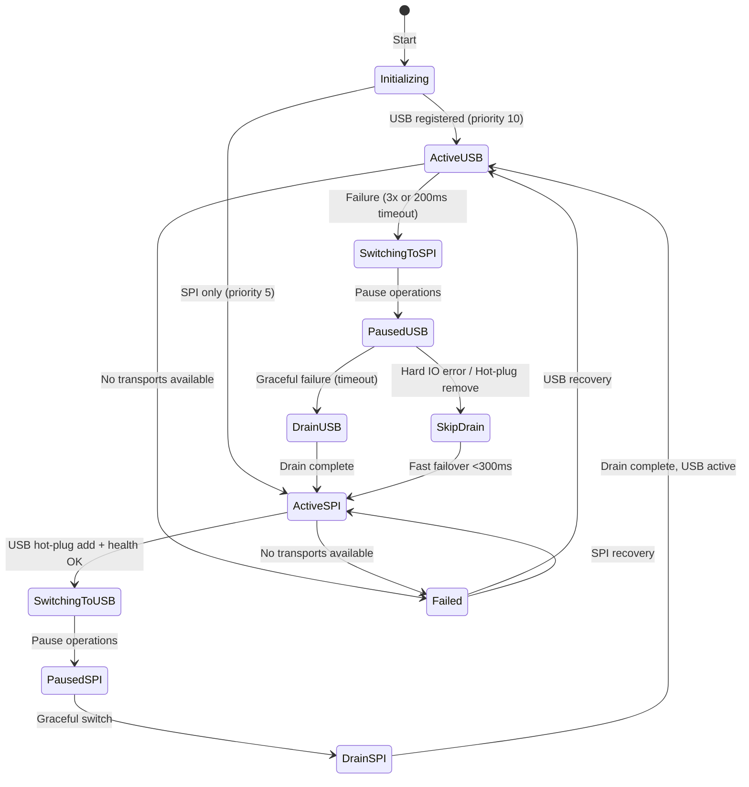

# STAR Gateway Transport Architecture

## Overview

The STAR Gateway implements intelligent transport switching between USB CDC (primary) and SPI (backup) for communication with the RX72N motor controller. The system automatically prefers USB for its simplicity but seamlessly fails over to SPI if USB becomes unavailable, with automatic recovery when USB returns.

**Design Philosophy:**
- **Lightweight CDC Protocol**: No application-level HARQ/FEC (USB hardware provides reliability)
- **Hybrid Heartbeat**: Implicit detection via telemetry + explicit PING/PONG when idle
- **Circuit Breaker Pattern**: Fast failure detection (~200ms) with automatic failover
- **Smart Switching**: Skip drain on hard failures, shared sequence state across transports
- **Zero Data Loss**: Sequence continuity maintained during transport switches

## Architecture Diagram

```
┌─────────────────────────────────────────────────────────────────┐
│                        gRPC Clients (UI)                        │
└────────────────────────────┬────────────────────────────────────┘
                             │ Protobuf/gRPC
┌────────────────────────────▼────────────────────────────────────┐
│              Layer 5: gRPC Services                             │
│  MotorControl │ Telemetry │ Battery │ Config │ Firmware        │
└────────────────────────────┬────────────────────────────────────┘
                             │
┌────────────────────────────▼────────────────────────────────────┐
│         Layer 4.5: Dispatcher (Message Router)                  │
│  - Demultiplexes by message type                                │
│  - Pub/sub to services                                          │
└────────────────────────────┬────────────────────────────────────┘
                             │
┌────────────────────────────▼────────────────────────────────────┐
│         Layer 4: Transport Manager (Smart Switching)            │
│  ┌──────────────────────────────────────────────────────────┐  │
│  │ State: Active USB │ Active SPI │ Switching │ Degraded    │  │
│  ├──────────────────────────────────────────────────────────┤  │
│  │ Health Monitor: Tracks consecutive failures, latency     │  │
│  │ Hot-Plug Detector: USB add/remove events (inotify)       │  │
│  │ Heartbeat Manager: Implicit + Explicit (PING/PONG)       │  │
│  │ Session State: Shared sequence counters (TX/RX)          │  │
│  └──────────────────────────────────────────────────────────┘  │
│                             │                                   │
│              ┌──────────────┴──────────────┐                    │
│              │                             │                    │
│    ┌─────────▼─────────┐        ┌─────────▼─────────┐          │
│    │   USB CDC Link    │        │    SPI Link       │          │
│    │ (Lightweight)     │        │  (Full HARQ)      │          │
│    │ - Framing only    │        │  - Retransmit     │          │
│    │ - Sequence track  │        │  - FEC (Viterbi)  │          │
│    │ - CRC32 validate  │        │  - Soft combining │          │
│    │ - NO retries      │        │  - ACK/NACK       │          │
│    └─────────┬─────────┘        └─────────┬─────────┘          │
└──────────────┼──────────────────────────────┼──────────────────┘
               │                              │
     ┌─────────▼─────────┐          ┌────────▼────────┐
     │  CDCTransport     │          │  SPITransport   │
     │  (USB CDC)        │          │  (10MHz SPI)    │
     │  /dev/ttyACM0     │          │  /dev/spidev0.0 │
     └─────────┬─────────┘          └────────┬────────┘
               │                              │
          ┌────▼──────────────────────────────▼────┐
          │           Raspberry Pi 5                │
          └────────────────┬────────────────────────┘
                           │ USB / SPI
          ┌────────────────▼────────────────────────┐
          │   RX72N Motor Controller (ThreadX)      │
          │   - Motor control (100Hz)                │
          │   - Encoder feedback                     │
          │   - Telemetry generation                 │
          └──────────────────────────────────────────┘
```

## Transport Comparison

| Feature | SPI Path | USB CDC Path | Rationale |
|---------|----------|--------------|-----------|
| **Physical Layer** | Full-duplex, synchronous | Half-duplex, asynchronous | Hardware characteristic |
| **Frame Format** | `[SYNC][SEQ][LEN][TYPE][FLAGS][PAYLOAD][CRC32]` | Same format | Unified for easy switching |
| **Error Detection** | CRC32 + FEC | CRC32 only | USB hardware has built-in CRC |
| **Retransmission** | Application-level (HARQ) | Hardware-level only | USB bulk transfer handles retries |
| **FEC** | Viterbi + Chase Combining | Disabled | Redundant with USB reliability |
| **ACK/NACK** | Required | Not sent | USB provides implicit ACK |
| **Sequence Tracking** | 16-bit counter (independent) | 16-bit counter (shared SessionState) | USB CDC uses shared state; SPI HARQ maintains independent sequences |
| **Priority** | Priority 5 | Priority 10 | Prefer simpler USB |
| **Typical Latency** | 1-2ms | <1ms | USB has lower overhead |
| **Reliability** | 99.99% (with retries) | 99.999% (hardware CRC) | USB more reliable |

## Protocol Specification

### Frame Format

All frames use the same wire format regardless of transport:

```
┌──────┬──────┬──────┬──────┬───────┬─────────┬───────┐
│ SYNC │ SEQ  │ LEN  │ TYPE │ FLAGS │ PAYLOAD │ CRC32 │
├──────┼──────┼──────┼──────┼───────┼─────────┼───────┤
│ 2B   │ 2B   │ 2B   │ 1B   │ 1B    │ 0-1024B │ 4B    │
└──────┴──────┴──────┴──────┴───────┴─────────┴───────┘
```

**Header Fields:**
- **SYNC**: Magic number `0x55AA` for frame synchronization
- **SEQ**: Sequence number (0-65535, wraps around)
- **LEN**: Payload length in bytes
- **TYPE**: Frame type (see below)
- **FLAGS**: Control flags (RequiresAck, HasFEC, etc.)
- **PAYLOAD**: Variable-length data (Protocol Buffer message)
- **CRC32**: IEEE 802.3 CRC-32 checksum

### Frame Types

```go
const (
    // Heartbeat frames
    FrameTypePing     = 0x00  // Heartbeat request
    FrameTypePong     = 0x01  // Heartbeat response

    // Data frames
    FrameTypeCommand  = 0x10  // Command frame
    FrameTypeResponse = 0x11  // Response frame

    // HARQ frames (SPI only)
    FrameTypeAck      = 0x12  // Acknowledgment
    FrameTypeNack     = 0x13  // Negative acknowledgment

    // Reset frames
    FrameTypeResetAck = 0xFE  // Reset acknowledgment
    FrameTypeReset    = 0xFF  // Reset request
)
```

**PING Frame:**
- **TYPE**: `0x00`
- **PAYLOAD**: 4-byte counter (big-endian uint32)
- **Purpose**: Explicit heartbeat when idle >50ms

**PONG Frame:**
- **TYPE**: `0x01`
- **PAYLOAD**: Echo of PING counter
- **Purpose**: Confirm link health, validate round-trip

### USB CDC Protocol (Lightweight)

The CDC protocol is designed for minimal overhead, relying on USB hardware for reliability:

**Send Path:**
1. Acquire `sendMutex` (serialize concurrent sends)
2. Get next TX sequence from shared `SessionState`
3. Create frame with sequence, CRC32
4. Encode to wire format
5. Write to `/dev/ttyACM0` with 50ms deadline
6. Release mutex (no wait for ACK)

**Receive Path:**
1. Read from `/dev/ttyACM0`
2. Decode frame, validate CRC32
3. Check sequence via `SessionState.ValidateRxSequence()`
   - Accept exact match (expected sequence)
   - Accept small gaps (<10 frames, log warning)
   - Reject duplicates or large gaps
4. Return payload to caller

**Key Features:**
- ✅ Sequence tracking via shared SessionState
- ✅ CRC32 validation
- ❌ No application-level retries
- ❌ No FEC encoding
- ❌ No ACK/NACK frames

### SPI Protocol (Full HARQ)

The SPI protocol uses Chase Combining (Type I HARQ) for robustness:

**Send Path:**
1. Create frame with sequence, RequiresAck flag
2. Encode with Viterbi FEC (rate 1/2, K=7)
3. Calculate CRC32
4. Transfer via full-duplex SPI (10MHz)
5. Wait for ACK/NACK (timeout: 10ms)
6. On NACK: retransmit (up to 3 attempts)

**Receive Path:**
1. Full-duplex SPI transfer
2. Viterbi decode with soft-bit combining
3. Validate CRC32
4. Check sequence (strict validation)
5. Send ACK or NACK based on CRC result
6. Chase combine on retransmissions

**Key Features:**
- ✅ Application-level retries (up to 3x)
- ✅ Viterbi FEC with soft combining
- ✅ ACK/NACK handshake
- ✅ Sequence tracking (independent, future: will be unified with USB)

## Heartbeat Mechanism

### Hybrid Implicit/Explicit Detection

The heartbeat system uses two complementary approaches:

**1. Implicit Detection (Primary)**
- Update `LastSeen` timestamp when ANY valid frame arrives
- Frames include: telemetry, command ACK, PONG, data responses
- Zero overhead when link is active

**2. Explicit Detection (Fallback)**
- Send PING frame if idle for >50ms
- Wait for PONG response
- Prevents false timeouts during idle periods

**3. Failure Detection**
- Declare link dead if no frames for >200ms
- Trigger failover to backup transport
- Reset `LastSeen` on successful switch

### Heartbeat Manager

```go
type HeartbeatManager struct {
    lastSeen       time.Time
    pingCounter    uint32
    pingInterval   time.Duration  // 50ms
    failureTimeout time.Duration  // 200ms
    onLinkFailed   func()         // Callback to TransportManager
}
```

**Run Loop:**
```go
func (hm *HeartbeatManager) Run(ctx context.Context, tm *TransportManager) {
    ticker := time.NewTicker(hm.pingInterval)
    defer ticker.Stop()

    for {
        select {
        case <-ctx.Done():
            return
        case <-ticker.C:
            elapsed := time.Since(hm.lastSeen)

            // Check for timeout (failure detection)
            if elapsed > hm.failureTimeout {
                log.Printf("Heartbeat timeout (%v), triggering failover", elapsed)
                hm.onLinkFailed()
                return
            }

            // Send explicit PING if idle
            if elapsed > hm.pingInterval {
                hm.sendPing(tm)
            }
        }
    }
}
```

**Benefits:**
- Minimal bandwidth overhead (<0.5% when idle)
- Fast failure detection (200ms vs 5s polling)
- No false positives from buffered OS data

## State Machine



**State Descriptions:**

| State | Description | Actions |
|-------|-------------|---------|
| **Initializing** | Manager starting, detecting transports | Register transports, select best |
| **ActiveUSB** | USB CDC active, heartbeat monitoring | Send/Receive via USB, monitor health |
| **ActiveSPI** | SPI active, heartbeat monitoring | Send/Receive via SPI, monitor health |
| **SwitchingToSPI** | Transitioning USB → SPI | Pause operations, smart drain (conditional) |
| **SwitchingToUSB** | Transitioning SPI → USB | Pause operations, smart drain (conditional) |
| **Degraded** | Active transport unhealthy, no alternatives | Continue with degraded transport, log warnings |
| **Failed** | No healthy transports available | Log error, retry probing |

**Note:** Operations are paused during switching states, and smart drain logic conditionally drains in-flight operations based on failure type (graceful/timeout drain, hard failures skip).

## Failover Logic

### Trigger Conditions

| Trigger | Failure Type | Drain? | Failover Time |
|---------|--------------|--------|---------------|
| 3 consecutive Send/Receive failures | `FailureTypeIOError` | Skip | <300ms |
| 200ms heartbeat timeout | `FailureTypeTimeout` | Execute | <700ms |
| USB hot-plug remove event | `FailureTypeHotPlugRemove` | Skip | <300ms |
| Health check failed (probe) | `FailureTypeHealthCheck` | Skip | <300ms |
| Manual switch (config change) | `FailureTypeGraceful` | Execute | <1s |

### Smart Drain Logic

The transport manager uses **smart drain logic** to minimize failover time:

```go
type FailureType int

const (
    FailureTypeGraceful      FailureType = iota  // Config change, priority upgrade - drain OK
    FailureTypeTimeout                           // Heartbeat timeout - drain OK
    FailureTypeIOError                           // Hard IO error - skip drain
    FailureTypeHealthCheck                       // Failed health check - skip drain
    FailureTypeHotPlugRemove                     // USB unplugged - skip drain
)

func (tm *TransportManager) executeSwitch(target *TransportWrapper, failureType FailureType) error {
    // Step 1: Pause operations (block new Send/Receive)
    tm.pauseOperations()
    defer tm.resumeOperations()

    // Step 2: Smart drain - skip if hard failure
    shouldDrain := (failureType == FailureTypeGraceful || failureType == FailureTypeTimeout)

    if shouldDrain {
        if err := tm.drainInflight(tm.config.SwitchTimeout); err != nil {
            log.Printf("WARNING: Drain timeout, continuing: %v", err)
        }
    } else {
        log.Printf("Skipping drain for failure type: %v (hard failure)", failureType)
    }

    // Step 3: Reset old transport (if accessible)
    if tm.activeTransport != nil {
        tm.activeTransport.Reset()
    }

    // Step 4: Activate new transport
    tm.activeTransport = target.Transport
    tm.activeTransportName = target.Name

    // Step 5: Resume operations (unblock Send/Receive)
    return nil
}
```

**Rationale:**
- **Graceful switches** (timeout, config change): Safe to wait 500ms for drain
- **Hard failures** (USB disconnect, IO error): Device non-responsive, skip drain for fast failover

### Sequence Continuity

**Critical Design Decision**: Sequence numbers are **shared across all transports** via `SessionState`:

```go
type SessionState struct {
    mu         sync.Mutex
    txSequence uint16  // Shared TX sequence (incremented on every Send)
    rxSequence uint16  // Shared RX sequence (validated on every Receive)
}
```

**Why This Matters:**
- If USB fails at TX Sequence 105 and switches to SPI, SPI must start at 106
- If SPI reset to 0, RX72N would reject packets as duplicates
- Shared state ensures **zero duplicate execution** during transport switches

**Sequence Validation:**
```go
func (s *SessionState) ValidateRxSequence(seq uint16) bool {
    diff := seq - s.rxSequence

    // Exact match - most common case
    if diff == 0 {
        s.rxSequence = (s.rxSequence + 1) & 0xFFFF
        return true
    }

    // Small gap (packet loss on USB) - Accept and catch up
    const maxGapTolerance = 10
    if diff > 0 && diff < maxGapTolerance {
        log.Printf("WARN: Skipped %d frames (packet loss), expected %d, got %d",
            diff, s.rxSequence, seq)
        s.rxSequence = (seq + 1) & 0xFFFF
        return true
    }

    // Large gap or duplicate - reject
    log.Printf("ERROR: Sequence mismatch, expected %d, got %d (diff=%d)",
        s.rxSequence, seq, diff)
    return false
}
```

## Health Monitoring

### Health Metrics

Each transport tracks the following metrics:

```go
type HealthMetrics struct {
    ConsecutiveFailures int           // Consecutive errors (reset on success)
    TotalSent          int            // Total frames sent
    TotalReceived      int            // Total frames received
    TotalErrors        int            // Total errors encountered
    AvgLatency         time.Duration  // Moving average latency
    LastSuccess        time.Time      // Last successful operation
    LastFailure        time.Time      // Last error
    IsHealthy          bool           // Current health status
}
```

### Health Probing

The Health Monitor periodically probes **inactive** transports to detect recovery:

**USB Probe (Non-Intrusive):**
```go
func (hm *HealthMonitor) probeUSB() bool {
    // Try to open /dev/ttyACM0
    port, err := serial.Open(transport.DefaultCDCDevice, &serial.Mode{
        BaudRate: transport.DefaultBaudRate,
    })
    if err != nil {
        return false  // Device not available
    }

    // Close immediately (just checking accessibility)
    port.Close()
    return true
}
```

**SPI Probe (PING/PONG):**
```go
func (hm *HealthMonitor) probeSPI(wrapper *TransportWrapper) bool {
    ctx, cancel := context.WithTimeout(context.Background(), 50*time.Millisecond)
    defer cancel()

    // Create PING payload with test marker
    payload := make([]byte, 4)
    binary.BigEndian.PutUint32(payload, 0xDEADBEEF)

    // Send PING
    if err := wrapper.Transport.Send(ctx, payload); err != nil {
        return false
    }

    // Wait for PONG
    result, err := wrapper.Transport.Receive(ctx)
    if err != nil {
        return false
    }

    // Validate PONG payload
    if len(result.Payload) != 4 {
        return false
    }

    receivedCounter := binary.BigEndian.Uint32(result.Payload)
    return receivedCounter == 0xDEADBEEF
}
```

**Probing Schedule:**
- Interval: 5 seconds (configurable)
- Timeout: 50ms per probe
- Only probes **inactive** transports (won't interfere with active link)

## Configuration

### Transport Modes

| Mode | Behavior | Use Case |
|------|----------|----------|
| `auto` | Register both USB and SPI, prefer USB | Production (default) |
| `prefer-usb` | Same as auto | Explicit preference |
| `force-usb` | Only register USB, fail if unavailable | USB-only testing |
| `force-spi` | Only register SPI, skip USB registration | SPI-only testing |

### Configuration Example

```go
config := manager.DefaultConfig()
config.Mode = manager.ModeAuto
config.FailureThreshold = 3
config.SwitchTimeout = 500 * time.Millisecond
config.HealthCheckInterval = 5 * time.Second

tm := manager.NewTransportManager(config)
```

## Development Guide

### Adding a New Transport

To add a new transport (e.g., Ethernet, CAN):

1. **Implement `transport.Device` interface:**
   ```go
   type Device interface {
       Transfer(ctx context.Context, txData []byte) ([]byte, error)
       Open() error
       Close() error
       Receive(len int) ([]byte, error)
       Send(data []byte) (int, error)
       IsOpen() bool
   }
   ```

2. **Create Link Layer (implement `harq.HARQ`):**
   ```go
   type MyLink struct {
       transport    transport.Device
       encoder      frame.Encoder
       decoder      *frame.StreamDecoder
       sessionState *manager.SessionState  // Shared with other transports
   }

   func (m *MyLink) Send(ctx context.Context, data []byte, p ...harq.Priority) error {
       // Implement send logic
   }
   ```

3. **Register with TransportManager:**
   ```go
   myTransport := NewMyTransport(config)
   myLink := NewMyLink(myTransport, sessionState)
   tm.RegisterTransport("my-transport", myLink, priority)
   ```

4. **Add Health Probe:**
   ```go
   func (hm *HealthMonitor) probeMyTransport(wrapper *TransportWrapper) bool {
       // Implement health check
   }
   ```

### Testing

**Unit Tests:**
```bash
# Test individual components
go test ./internal/link -v -run TestCDCLink
go test ./internal/manager -v -run TestHeartbeat
go test ./internal/manager -v -run TestScenario
```

**Integration Tests:**
```bash
# Test with mock RX72N (requires virtual serial port)
socat -d -d pty,raw,echo=0 pty,raw,echo=0
export CDC_DEVICE=/dev/pts/3  # Use virtual port
go test ./internal/link -v -run TestCDCLink_Integration
```

**Coverage:**
```bash
go test ./internal/... -coverprofile=coverage.out
go tool cover -html=coverage.out
```

### Debugging

**Enable debug logging:**
```bash
export GATEWAY_LOG_LEVEL=debug
./star-gateway
```

**Monitor transport switches:**
```bash
# Watch for transport switch events
tail -f /var/log/star-gateway/gateway.log | grep "Transport switch"
```

**Check health metrics:**
```bash
# gRPC call to get health metrics (requires gRPC endpoint)
grpcurl -plaintext localhost:50051 star.v1.Gateway/GetHealth
```

### Common Issues

**Issue: Frequent transport switches**
- **Cause**: USB device unstable, poor connection
- **Fix**: Check USB cable, check `dmesg` for USB errors

**Issue: Failover too slow (>1s)**
- **Cause**: Drain timeout on disconnected device
- **Fix**: Verify smart drain logic is skipping drain on `FailureTypeIOError`

**Issue: Sequence mismatch after switch**
- **Cause**: SessionState not shared between links
- **Fix**: Verify both CDCLink and SPILink use same SessionState instance

**Issue: Duplicate command execution**
- **Cause**: RX72N not sharing sequence counter across USB/SPI
- **Fix**: Update RX72N firmware to use shared sequence state

## Performance Characteristics

### Latency

| Operation | USB CDC | SPI | Notes |
|-----------|---------|-----|-------|
| Send (1KB) | 0.5-1ms | 1-2ms | USB lower overhead |
| Receive (1KB) | 0.5-1ms | 1-2ms | Similar performance |
| Heartbeat PING/PONG | 0.3-0.5ms | 0.5-1ms | Round-trip time |
| Failover (graceful) | 500-700ms | N/A | Includes drain |
| Failover (hard failure) | 200-300ms | N/A | Skip drain |

### Throughput

| Transport | Theoretical Max | Practical Max | Typical |
|-----------|----------------|---------------|---------|
| USB CDC | 12 Mbps (USB Full-Speed) | 10 Mbps | 5-8 Mbps |
| SPI | 10 MHz × 8 bits = 80 Mbps | 40 Mbps (half-duplex frames) | 20-30 Mbps |

**Note**: Practical throughput limited by:
- Protocol overhead (framing, CRC)
- FEC encoding (SPI only, 2x overhead)
- ACK/NACK handshake (SPI only)
- Application-level framing

### Resource Usage

| Component | Memory | CPU (Idle) | CPU (Active) |
|-----------|--------|------------|--------------|
| TransportManager | 2 KB | <1% | 2-5% |
| CDCLink | 4 KB (buffers) | <1% | 1-2% |
| SPILink | 8 KB (buffers + FEC) | <1% | 3-8% |
| HeartbeatManager | <1 KB | <1% | <1% |
| HealthMonitor | <1 KB | <1% | <1% |
| **Total** | **~15 KB** | **<2%** | **5-15%** |

## References

- **USB CDC Specification**: USB Class Definitions for Communications Devices 1.2
- **SPI Specification**: Motorola SPI Block Guide V03.06
- **HARQ**: Chase Combining (Type I Hybrid ARQ)
- **FEC**: Viterbi Algorithm for Convolutional Codes
- **Distributed Systems**: Circuit Breaker Pattern (Michael Nygard)
- **STAR Documentation**: `docs/sections/07_gateway_architecture.tex`

## Change Log

| Date | Version | Changes |
|------|---------|---------|
| 2026-01-30 | 1.0.0 | Initial architecture documentation (Phase 7) |
